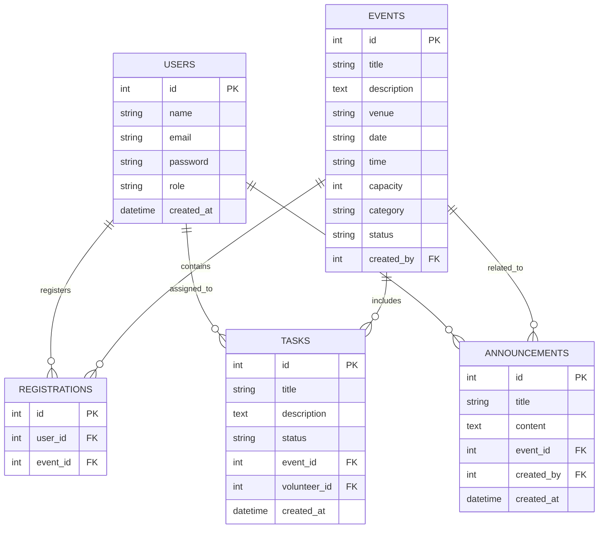
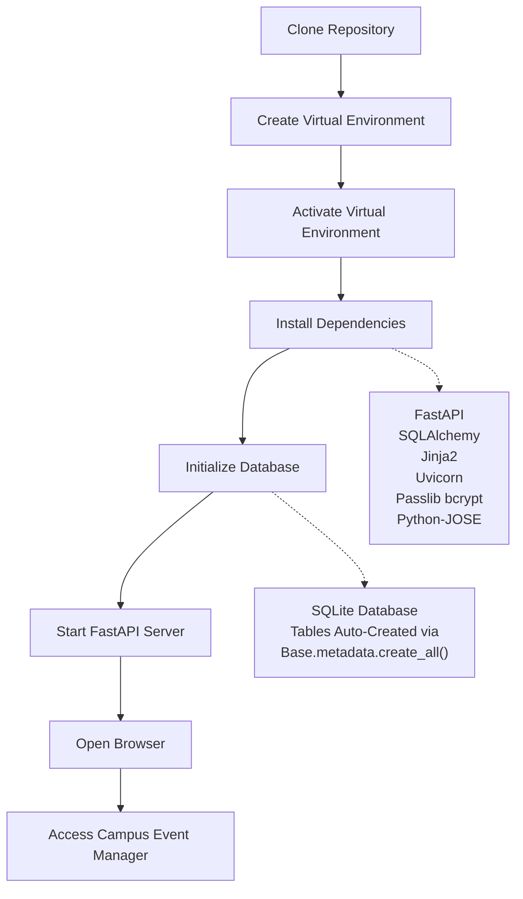
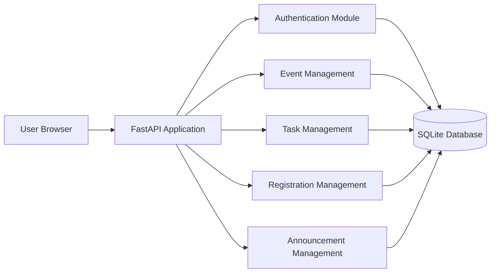

# CampusX : Campus Event Manager Platform

A web-based event management platform developed using **FastAPI**, **SQLAlchemy**, **Jinja2 Templates**, and **SQLite**. The system streamlines campus event organization by providing role-based access for Administrators, Volunteers, and Participants.

---

# Overview

Campus Event Manager is designed to simplify the planning, coordination, and execution of campus events. The platform enables administrators to create and manage events, assign tasks to volunteers, publish announcements, and monitor registrations. Participants can browse events and register for them, while volunteers can view and manage assigned tasks.

---

# Features

## User Management

* User Registration
* User Login and Logout
* Secure Password Hashing using bcrypt
* JWT-based Authentication
* Role-Based Access Control (RBAC)

### Supported Roles

* Administrator
* Volunteer
* Participant

---

## Event Management

Administrators can:

* Create Events
* Edit Event Details
* Delete Events
* Manage Event Capacity
* Categorize Events
* Track Event Status

---

## Registration Management

Participants can:

* View Available Events
* Register for Events

Administrators can:

* View All Registrations
* Monitor Participation Metrics

---

## Volunteer Task Management

Administrators can:

* Create Tasks
* Assign Tasks to Volunteers
* Monitor Task Progress

Volunteers can:

* View Assigned Tasks
* Track Task Status

---

## Announcement System

Administrators can:

* Create Announcements
* Publish Event Updates
* Share Event Information

Participants and Volunteers can:

* View Announcements

---

## Dashboard Analytics

### Administrator Dashboard

Displays:

* Total Events
* Total Tasks
* Total Registrations
* Pending Tasks

### Volunteer Dashboard

Displays:

* Assigned Tasks
* Pending Tasks
* Confirmed Tasks
* Registration Overview

### Participant Dashboard

Displays:

* Personal Registration Count

---

# Technology Stack

## Backend

* FastAPI
* Python 3.x

## Database

* SQLite
* SQLAlchemy ORM

## Frontend

* HTML5
* CSS3
* JavaScript
* Jinja2 Templates

## Authentication

* JWT (JSON Web Tokens)
* Passlib (bcrypt)

---

# System Architecture

```text
+-------------------+
|      Browser      |
+-------------------+
          |
          v
+-------------------+
|     FastAPI       |
|  Application API  |
+-------------------+
          |
          v
+-------------------+
| Authentication    |
| Authorization     |
+-------------------+
          |
          v
+-------------------+
| SQLAlchemy ORM    |
+-------------------+
          |
          v
+-------------------+
| SQLite Database   |
+-------------------+
```

---
## Entity Relationship Diagram


---
## API Endpoints

### Authentication Endpoints

| Method | Endpoint    | Description                                    |
| ------ | ----------- | ---------------------------------------------- |
| GET    | `/`         | Redirects user to login page                   |
| GET    | `/register` | Displays user registration page                |
| POST   | `/register` | Creates a new user account                     |
| GET    | `/login`    | Displays login page                            |
| POST   | `/login`    | Authenticates user and creates session         |
| GET    | `/logout`   | Logs out user and clears authentication cookie |

---

### Dashboard Endpoint

| Method | Endpoint     | Description                                                        |
| ------ | ------------ | ------------------------------------------------------------------ |
| GET    | `/dashboard` | Displays role-based dashboard with statistics and user information |

---

### Event Management Endpoints

| Method | Endpoint                    | Description                       |
| ------ | --------------------------- | --------------------------------- |
| GET    | `/events`                   | Retrieves and displays all events |
| GET    | `/events/create`            | Displays event creation form      |
| POST   | `/events/create`            | Creates a new event               |
| GET    | `/events/delete/{event_id}` | Deletes a selected event          |

---

### Event Registration Endpoints

| Method | Endpoint                     | Description                                             |
| ------ | ---------------------------- | ------------------------------------------------------- |
| POST   | `/register-event/{event_id}` | Registers a participant for an event                    |
| GET    | `/my-events`                 | Displays events registered by the logged-in participant |
| GET    | `/registrations`             | Displays all event registrations                        |

---

### Task Management Endpoints

| Method | Endpoint                           | Description                 |
| ------ | ---------------------------------- | --------------------------- |
| GET    | `/tasks`                           | Displays all tasks          |
| GET    | `/tasks/create`                    | Displays task creation form |
| POST   | `/tasks/create`                    | Creates and assigns a task  |
| GET    | `/tasks/update/{task_id}/{status}` | Updates task status         |

---

### Announcement Endpoints

| Method | Endpoint                | Description                 |
| ------ | ----------------------- | --------------------------- |
| GET    | `/announcements`        | Displays announcements page |
| POST   | `/announcements/create` | Creates a new announcement  |

---

## API Summary

| Module         | Total Endpoints  |
| -------------- | ---------------- |
| Authentication | 6                |
| Dashboard      | 1                |
| Events         | 4                |
| Registrations  | 3                |
| Tasks          | 4                |
| Announcements  | 2                |
| **Total**      | **20 Endpoints** |

---

## Route Parameters

### Event ID

Used to identify a specific event.

```text
/events/delete/{event_id}
/register-event/{event_id}
```

Example:

```text
/events/delete/5
/register-event/5
```

### Task ID and Status

Used to update task progress.

```text
/tasks/update/{task_id}/{status}
```

Example:

```text
/tasks/update/12/Completed
```

---

## HTTP Methods Used

| Method | Purpose                               |
| ------ | ------------------------------------- |
| GET    | Retrieve pages and data               |
| POST   | Create new resources and submit forms |

The application follows a server-rendered architecture using FastAPI and Jinja2 templates, where most user interactions are handled through HTML forms and page redirects rather than JSON-based REST APIs.
---
## Setup & Installation Workflow


---
# Database Entities

The system consists of the following entities:

### Users

Stores user information and role details.

### Events

Stores event information and scheduling details.

### Registrations

Tracks participant registrations for events.

### Tasks

Manages volunteer assignments.

### Announcements

Stores event and system announcements.

---

# Project Structure

```text
app/
│
├── main.py
├── auth.py
├── database.py
├── models.py
│
├── routers/
│   ├── events.py
│   ├── registrations.py
│   ├── tasks.py
│   └── announcements.py
│
├── templates/
│   ├── login.html
│   ├── register.html
│   ├── dashboard.html
│   └── ...
│
└── static/
    ├── style.css
    └── main.js
```

---

## Installation

### 1. Clone Repository

```bash
git clone <repository-url>
cd campus-event-manager
```

### 2. Create Virtual Environment

```bash
python -m venv venv
```

### 3. Activate Environment

#### Linux / macOS

```bash
source venv/bin/activate
```

#### Windows

```bash
venv\Scripts\activate
```

### 4. Install Dependencies

```bash
pip install -r requirements.txt
```

### 5. Run Application

```bash
uvicorn app.main:app --reload
```
---
## Deployment Architecture



---

# User Workflow

## Administrator

1. Login
2. Create Events
3. Assign Volunteer Tasks
4. Publish Announcements
5. Monitor Registrations

## Volunteer

1. Login
2. View Assigned Tasks
3. Track Task Status
4. Access Event Information

## Participant

1. Register Account
2. Browse Events
3. Register for Events
4. View Event Updates

---

# Security Features

* Password Hashing with bcrypt
* JWT Authentication
* HTTP-Only Cookies
* Role-Based Authorization
* Protected Dashboard Access

---

# Future Enhancements

* Email Notifications
* Event Attendance Tracking
* QR Code Check-In
* Calendar Integration
* Advanced Reporting Dashboard
* Real-Time Notifications
* PostgreSQL Support
* Cloud Deployment

---

# Learning Outcomes

This project demonstrates:

* FastAPI Application Development
* RESTful Routing
* SQLAlchemy ORM Integration
* Authentication and Authorization
* Database Design
* Template Rendering with Jinja2
* CRUD Operations
* Role-Based Access Control

---

# Author

Developed as a full-stack web application for managing campus events, volunteer coordination, participant registrations, and event communication.

---

# License

This project is intended for educational and academic purposes.
